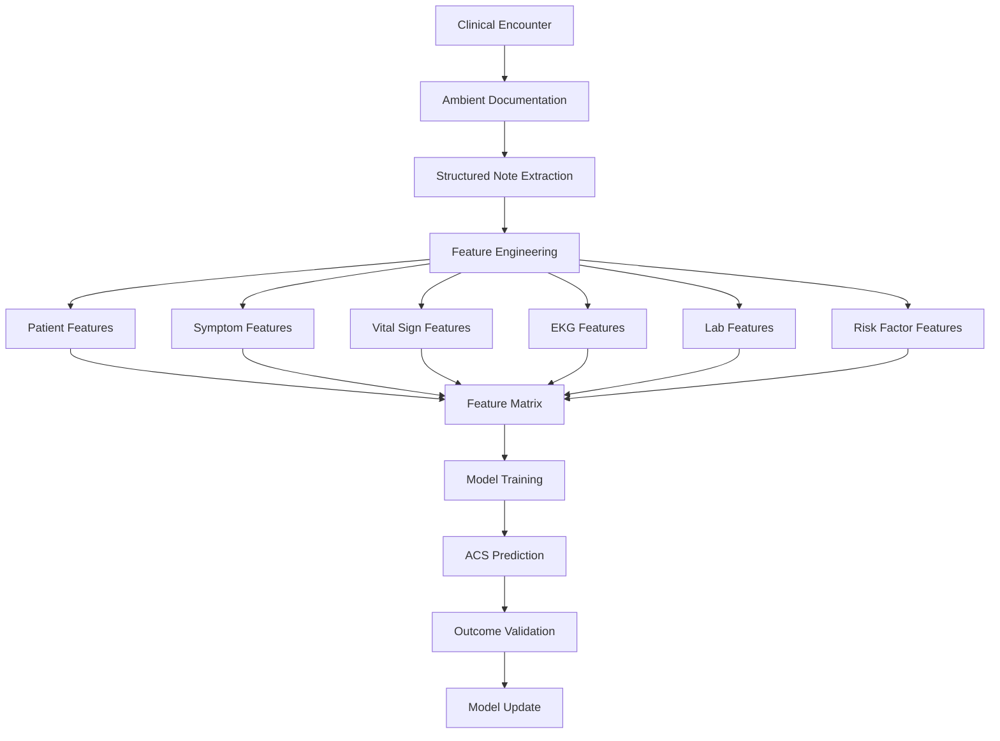
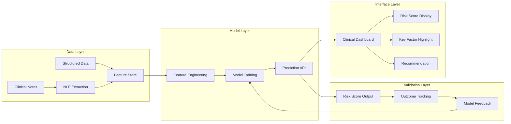

# ED Chest Pain Analytics

Predictive analytics for emergency department chest pain evaluation.

Stanford MCiM Practicum Project — Andrew Napier, MD

---

## Overview

Chest pain is the second most common ED chief complaint in the US. Despite decades of protocols (HEART score, TIMI, GRACE), clinician judgment drives most disposition decisions. This project builds a machine learning pipeline that learns from paired ambient-to-note data to predict acute coronary syndrome risk in real time.

**The core insight:** Clinical documentation systems that record both the raw patient encounter and the physician's full decision trace generate the richest supervised learning dataset in medicine. Every encounter pairs:
- Container 1: What the patient presented with (ambient data, vitals, symptoms)
- Container 2: What the physician decided and why (diagnosis, workup, results, disposition)

Most health AI trains on AI-generated notes. This trains on physician-authored ground truth.

---

## Clinical Problem

**Why chest pain is hard:**

- 7-8 million ED chest pain visits annually in the US
- Only 5-15% are true ACS
- Missing ACS is catastrophic (death, lawsuit)
- Over-admitting is expensive (~$10,000/unnecessary admission)
- Current risk scores are static — they don't learn from outcomes

**Current state of practice:**

Clinicians use the HEART score, troponin kinetics, EKG interpretation, and gestalt. Risk stratification is a manual process done at the bedside with no feedback loop.

**What this project adds:**

A predictive model trained on actual physician decision-making at scale, with a feedback loop from outcomes.

---

## Methodology

### Data Pipeline



### Feature Categories

**Presentation features (Container 1 — patient data)**
- Chief complaint characteristics: onset, duration, quality, severity, radiation
- Associated symptoms: diaphoresis, dyspnea, nausea, syncope
- Vital signs: HR, BP, RR, SpO2, temperature
- Demographics: age, sex (ACS risk differs significantly)
- Time of presentation

**Decision trace features (Container 2 — physician reasoning)**
- Working diagnosis at presentation
- Ordered workup (which labs, which imaging, which consults)
- EKG interpretation
- Troponin ordering pattern and result interpretation
- Disposition decision: discharge, observation, admission, cath lab

**Risk stratification features**
- HEART score components (where documented)
- Prior cardiac history
- Cardiac risk factors: HTN, DM, hyperlipidemia, smoking, family history
- Prior troponin values if available

### Models

**Phase 1 (current): Baseline scaffold**

```python
from sklearn.linear_model import LogisticRegression
from sklearn.ensemble import RandomForestClassifier
from sklearn.preprocessing import StandardScaler

# Binary outcome: ACS yes/no at 30 days
# Features: regex-extracted from structured notes
# Training set: 360 encounters

baseline_model = LogisticRegression(
    class_weight='balanced',  # ACS is rare — handle imbalance
    C=1.0,
    max_iter=1000
)
```

Phase 1 proves the pipeline. It throws away most of the signal by reducing physician reasoning to binary labels.

**Phase 2 (planned): Rich extraction**

```python
# Extract full reasoning chain from Container 2, not just outcome
# Multi-label: ACS type, intervention required, 30-day MACE
# Learn from physician's workup pattern, not just their conclusion
```

**Phase 3 (planned): Continuous learning**

```python
# Online learning as new encounters arrive
# Outcome feedback loop: 30-day MACE rates close the loop
# Cross-physician learning: patterns that work across clinicians
```

### Validation

- Primary metric: AUC-ROC for ACS prediction
- Secondary: sensitivity/specificity at clinical operating points
- Clinical benchmark: HEART score performance on same cohort
- Safety threshold: sensitivity >= 95% (missing ACS is the primary risk)

---

## Architecture



---

## Project Structure

```
ed-chest-pain-analytics/
├── README.md
├── docs/
│   ├── architecture.md          # Detailed system design
│   ├── feature-engineering.md   # Feature definitions and rationale
│   ├── model-selection.md       # Model comparison and selection rationale
│   └── clinical-validation.md   # Clinical significance and safety analysis
├── notebooks/
│   ├── 01-eda.ipynb             # Exploratory data analysis
│   ├── 02-feature-engineering.ipynb
│   ├── 03-baseline-model.ipynb
│   └── 04-validation.ipynb
├── src/
│   ├── features/                # Feature extraction modules
│   ├── models/                  # Model training and evaluation
│   ├── api/                     # Prediction API
│   └── utils/                   # Shared utilities
└── tests/
```

---

## Clinical Significance

**Why this matters:**

- Missed ACS kills patients. Annual malpractice exposure from missed MI runs billions.
- Over-admission wastes resources and exposes low-risk patients to hospital complications.
- Current risk scores don't improve. They're static formulas. This learns.

**The physician reasoning advantage:**

Other predictive models use billing codes, lab values, demographics. This model learns from the physician's actual reasoning trace — the workup they chose, the differential they considered, the factors that drove disposition. That's a qualitatively different input.

**Limitations (honest accounting):**

- Phase 1 training set is small (360 cases) — not for clinical use
- Retrospective design — prospective validation required before clinical deployment
- Single-site data — generalizability not yet established
- Outcome labels dependent on documentation completeness

---

## Academic Context

**Program:** Stanford Clinical Informatics (MCiM)

**Practicum focus:** Building the predictive analytics infrastructure to translate ambient clinical documentation into real-time decision support tools.

**Broader research question:** Can physician decision traces — captured as a byproduct of documentation — serve as training signal for clinical ML models that outperform traditional risk scores?

---

## Status

- [x] Phase 1: Pipeline scaffold with logistic regression (360 cases)
- [x] AMIA 2026 podium abstract accepted (`#15227`)
- [ ] AMIA final-program abstract revision
- [ ] Phase 1 pilot cleanup: reviewer-count language, ECE definition, Section 5G plain-language rewrite
- [ ] Phase 2: Rich feature extraction plus differential-diagnosis safety layer
- [ ] Phase 3: Continuous learning with outcome feedback
- [ ] Prospective validation study design
- [ ] Clinical dashboard MVP

Current AMIA and post-MCiM next-step plan: [docs/amia-2026-next-steps.md](docs/amia-2026-next-steps.md)

---

*Stanford MCiM Practicum — Andrew Napier, MD*
